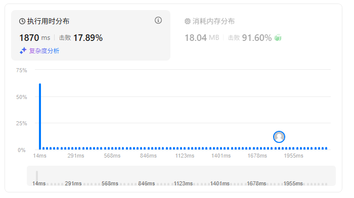
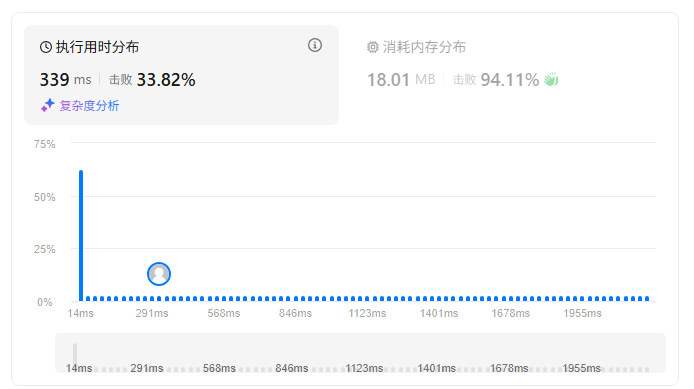
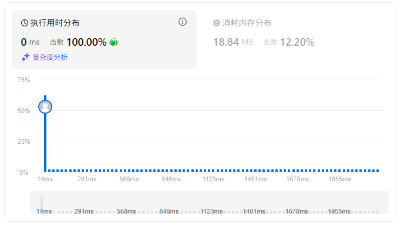
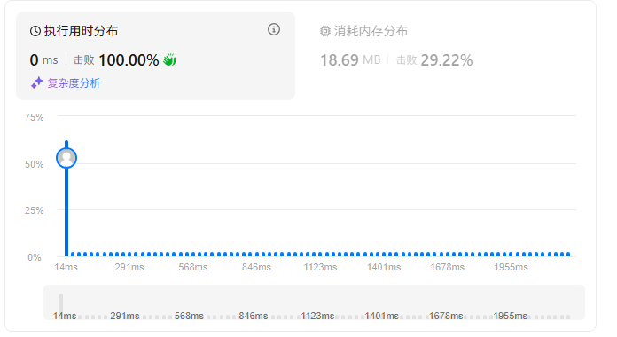
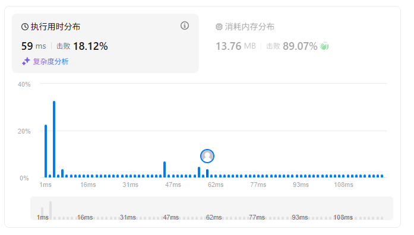
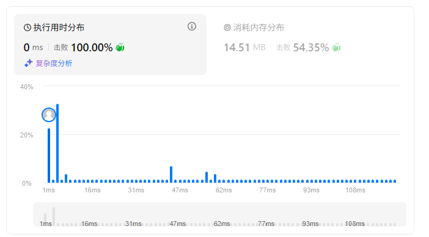

题目描述：  
（PS：执行用时、消耗内存情况每次提交结果不同）  
给定一个整数数组`nums`和一个目标值`target`，请你在该数组中找出和为目标值的那`两个`整数，并返回他们的数组下标。
你可以假设每种输入只会对应一个答案。但是，你不能重复利用这个数组中同样的元素。

示例:
```
给定 nums = [2, 7, 11, 15], target = 9
因为 nums[0] + nums[1] = 2 + 7 = 9
所以返回 [0, 1]

```
## Python
1、遍历两次，找到匹配的结果，需要注意返回的下标值
```python
class Solution:
    def twoSum(self, nums, target):
        """
        :type nums: List[int]
        :type target: int
        :rtype: List[int]
        """
        for i,v1 in enumerate(nums):
            for j,v2 in enumerate(nums[i+1:]):
                if v1+v2 == target:
                    return [i, j+i+1]
```


2、遍历一次，判断target-nums[i]是否在nums[i+1::]中，返回i和target-nums[i]在nums中的索引  
```python
class Solution:
    def twoSum(self, nums, target):
        """
        :type nums: List[int]
        :type target: int
        :rtype: List[int]
        """
        for i in range(len(nums)-1):
            if target-nums[i] in nums[i+1::]:
                return [i,nums[i+1::].index(target-nums[i])+i+1]
```


3、使用`enumerate()`将`nums`组合成一个索引，遍历索引和值，将索引、值分别存到字典的值和键，反查`target`和当前值的差值是否在字典中的key中，如果不存在继续存储索引和值，如果存在，返回当前索引和匹配字典key的值（也就是nums的索引）
```python
class Solution:
    def twoSum(self, nums, target):
        """
        :type nums: List[int]
        :type target: int
        :rtype: List[int]
        """
        a = dict()
        for k,v in enumerate(nums):   # enumerate()方法将可迭代对象组合成一个索引序列  
            other_num = target - v
            if other_num in a.keys():
                return [a[other_num],k]
            a[v] = k   # 将值作为字典的key，将索引作为字典的值
```


4、遍历index，理论上速度更快
```python
class Solution:
    def twoSum(self, nums, target):
        """
        :type nums: List[int]
        :type target: int
        :rtype: List[int]
        """
        m = dict()
        for i in range(len(nums)):
            if target - nums[i] in m:
                return m[target - nums[i]], i
            else:
                m[nums[i]] = i
        return []
```



## C++

1、遍历两次
```c++
class Solution {
public:
    vector<int> twoSum(vector<int>& nums, int target) {
        for (int i=0;i<nums.size();i++){
            for (int j=i+1;j<nums.size();j++){
                if (nums[i]+nums[j]==target)
                {
                    return {i,j};
                }
            }
        }
        return {};
    }
};
```


2、使用哈希表存储
```c++
class Solution {
public:
    vector<int> twoSum(vector<int>& nums, int target) {
        // 使用哈希表来存储数值和对应的索引
        // key: 数组中的数值
        // value: 该数值在数组中的索引位置
        unordered_map<int, int> num_map;
        
        // 遍历数组中的每个元素
        for (int i = 0; i < nums.size(); ++i) {
            // 计算当前元素所需的补数（即目标值减去当前元素的值）
            int complement = target - nums[i];
            
            // 检查哈希表中是否已经存在这个补数
            // 如果存在，说明我们找到了两个数之和等于目标值
            if (num_map.count(complement)) {
                // 返回这两个数的索引：
                // - num_map[complement]: 补数在数组中的索引（之前存储的）
                // - i: 当前元素的索引
                return {num_map[complement], i};
            }
            
            // 将当前数值和它的索引存入哈希表
            // 这样在后续的迭代中，如果遇到这个数值的补数，就可以快速找到它
            num_map[nums[i]] = i;
        }
        
        // 如果遍历完整个数组都没有找到符合条件的两个数，返回空向量
        return {};
    }
};
```



