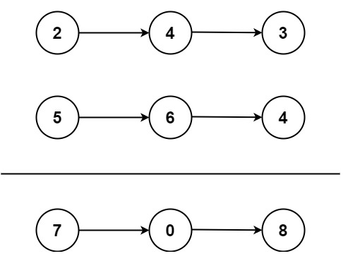

题目描述：  
（PS：执行用时、消耗内存情况，每次提交可能结果不同）  
给你两个`非空`的链表，表示两个非负的整数。它们每位数字都是按照`逆序`的方式存储的，并且每个节点只能存储`一位`数字。  
请你将两个数相加，并以相同形式返回一个表示和的链表。  
你可以假设除了数字`0`之外，这两个数都不会以`0`开头。  

示例:

```
输入：l1 = [2,4,3], l2 = [5,6,4]
输出：[7,0,8]
解释：342 + 465 = 807.
```
## Python
1、先将链表转为list，对list遍历求和，然后再将结果转为链表
```python
# Definition for singly-linked list.
# class ListNode:
#     def __init__(self, val=0, next=None):
#         self.val = val
#         self.next = next
class Solution:
    def addTwoNumbers(self, l1: Optional[ListNode], l2: Optional[ListNode]) -> Optional[ListNode]:
        res = []
        l1_list = []
        l2_list = []
        while l1.next:
            l1_list.append(l1.val)
            l1 = l1.next
        l1_list.append(l1.val)
        while l2.next:
            l2_list.append(l2.val)
            l2 = l2.next
        l2_list.append(l2.val)
        len_ = max(len(l1_list),len(l2_list))
        next_update = 0
        for i in range(len_):
            cur_sum = 0
            if (i+1) <= len(l1_list):
                cur_sum += l1_list[i]
            if (i+1) <= len(l2_list):
                cur_sum += l2_list[i]
            cur_sum += next_update
            if cur_sum >= 10:
                res.append(cur_sum % 10)
                next_update = 1
            else:
                res.append(cur_sum)
                next_update = 0
        if next_update == 1:
            res.append(1)
        
        res_node = ListNode(val=res[0])
        cur_ = res_node
        for i in range(1,len(res)):
            cur_node = ListNode(val=res[i])
            cur_.next = cur_node
            cur_ = cur_node
        return res_node
```


2、直接遍历两个链表、求和，当短的链表完成遍历时，会继续遍历长的链表进行求和
```python
# Definition for singly-linked list.
# class ListNode:
#     def __init__(self, val=0, next=None):
#         self.val = val
#         self.next = next
class Solution:
    def addTwoNumbers(self, l1: Optional[ListNode], l2: Optional[ListNode]) -> Optional[ListNode]:
        # 先处理第一个数据(这里增加了耗时)
        next_update = 0
        first_sum = l1.val + l2.val
        if first_sum >= 10:
            next_update = 1
            first_sum = first_sum % 10
        res_node_list = ListNode(val=first_sum)  # 返回结果
        cur_ = res_node_list  # 链表指针

        # 两个链表均完成遍历时，退出循环
        while (l1.next or l2.next):
            sum_ = 0
            if l1.next and l2.next: 
                sum_ = l1.next.val + l2.next.val + next_update
                l1 = l1.next
                l2 = l2.next
                next_update = 0
            elif l1.next:
                sum_ = l1.next.val + next_update
                l1 = l1.next
                next_update = 0
                if sum_ < 10:
                    # 当l2完成遍历，仅有l1时，如果求和小于10，则将l1后续的数据，直接追加到结果中
                    cur_node = ListNode(val=sum_)
                    cur_.next = cur_node
                    cur_.next.next = l1.next
                    break
            else:
                sum_ = l2.next.val + next_update
                l2 = l2.next
                next_update = 0
                if sum_ < 10:
                    cur_node = ListNode(val=sum_)
                    cur_.next = cur_node
                    cur_.next.next = l2.next
                    break
            if sum_ >= 10:
                next_update = 1
                sum_ = sum_ % 10
            cur_node = ListNode(val=sum_)
            cur_.next = cur_node
            cur_ = cur_.next

        # 处理最后一位
        if next_update == 1:
            cur_node = ListNode(val=1)
            cur_.next = cur_node
            cur_ = cur_.next
        return res_node_list

```


3、对上一步的代码进行优化：去除开始计算的根节点，优化代码结构，更为清晰（再优化：在短链遍历完成后，并且没有进位时，将长链直接追加到结果中）
```python
# Definition for singly-linked list.
# class ListNode:
#     def __init__(self, val=0, next=None):
#         self.val = val
#         self.next = next
class Solution:
    def addTwoNumbers(self, l1: Optional[ListNode], l2: Optional[ListNode]) -> Optional[ListNode]:
        node = ListNode()  # 初始化根节点（假的）
        node.next = ListNode()  # 初始化子节点（真实的根节点）
        res = node  # 用于返回结果
        next_update = 0  # 每次计算后，进位的值
        while (l1 or l2 or next_update):  # 退出循环条件
            node = node.next  # 指向下一个节点
            sum_ = next_update  # 赋值为进位值
            next_update = 0
            # break_flag = False
            if l1:
                sum_ += l1.val
                l1 = l1.next
            if l2:
                sum_ += l2.val
                l2 = l2.next
            next_update = sum_ // 10
            node.val = sum_ % 10
            node.next = ListNode()  # 创建子节点，用于下一次循环
        node.next = None  # 最终结果，需要去除循环中多添加的子节点
        return res.next
```


## C++
1、参考上面python的代码，用c++实现
```c++
/**
 * Definition for singly-linked list.
 * struct ListNode {
 *     int val;
 *     ListNode *next;
 *     ListNode() : val(0), next(nullptr) {}
 *     ListNode(int x) : val(x), next(nullptr) {}
 *     ListNode(int x, ListNode *next) : val(x), next(next) {}
 * };
 */
class Solution {
public:
    ListNode* addTwoNumbers(ListNode* l1, ListNode* l2) {
        ListNode* res = new ListNode();  // 结果链表的头节点（虚拟头节点）
        ListNode* node = res;  // 当前链表节点
        short sum_;
        bool nextUpdate = 0;

        while (l1 || l2 || nextUpdate) {
            sum_ = (short)nextUpdate;  // 进位
            if (l1) {
                sum_ += l1->val;  // 加上 l1 的值
                l1 = l1->next;
            }
            if (l2) {
                sum_ += l2->val;  // 加上 l2 的值
                l2 = l2->next;
            }

            // 更新进位，当前位值
            nextUpdate = (sum_ >= 10);
            node->next = new ListNode(sum_ % 10);  // 只创建需要的节点
            node = node->next;  // 向后移动节点
        }

        return res->next;  // 返回结果链表（去掉虚拟头节点）
    }
};
```


## 问题与思考
py的实现内存占用明显小于c++，chatGPT给的解释：  
1.1. 语言层面的差异：

C++：在 C++ 中，内存管理相对较为底层。每次调用 new 都会分配新的内存，这意味着每次创建新的 ListNode 都需要手动管理内存。在你的 C++ 代码中，node->next = new ListNode(); 在每次循环中都会进行新的内存分配。

Python：Python 的内存管理是由 Python 解释器（尤其是 CPython）自动处理的，并且 Python 的 ListNode 类是通过引用传递的。在你的 Python 代码中，虽然每次循环也会创建一个新的 ListNode 实例，但 Python 的垃圾回收机制会自动管理内存分配和释放，从而减少了内存的消耗。

1.2. 内存分配和释放：

C++：每次创建 ListNode 时，new 会在堆上分配内存，而且你需要手动释放内存（即使 C++ 有智能指针，仍然需要保证每个分配的内存都能得到释放）。如果你没有正确管理内存，可能会导致内存泄漏。

在你的 C++ 实现中，node->next = new ListNode(); 每次都分配新的内存，并且没有显式释放内存。这个内存分配的过程增加了 C++ 实现的内存消耗。

Python：Python 会自动管理内存并使用 垃圾回收 来处理不再使用的对象。当 ListNode 对象的引用计数为零时，内存会自动被回收，减少了内存消耗。在 Python 中，创建对象的开销较小，且内存释放较为透明，垃圾回收机制有效地减少了内存消耗。

1.3. 数据结构本身的不同：

C++ 使用结构体 ListNode 来实现链表。每次 new 都会分配独立的内存，导致内存开销较大。

Python 使用类 ListNode，而 Python 的对象分配和引用机制通常比 C++ 更加灵活和高效。

1.4. 内存管理效率：

Python 的内存管理通常是通过引用计数和垃圾回收（GC）机制来优化的。每次创建一个新的对象时，Python 会为其分配内存，并在不再使用时自动进行回收。而 C++ 需要开发者手动管理内存，或者通过智能指针来减少内存泄漏的风险。

1.5. 内存分配的具体实现：

在 Python 中，由于其内存分配是自动的，多个链表节点可能会共享内存池中的某些对象，减少了分配的总量。而 C++ 中，每个 new ListNode() 都会单独申请内存，从而使内存消耗增大。


如果要在c++实现类似py的内存消耗情况，需要使用内存池技术，复用链表中的节点内存，而不再创建新的内存，有点朝纲了。
