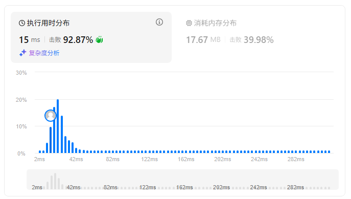
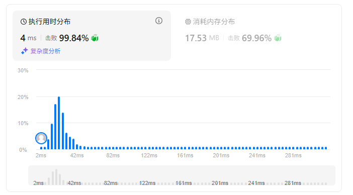
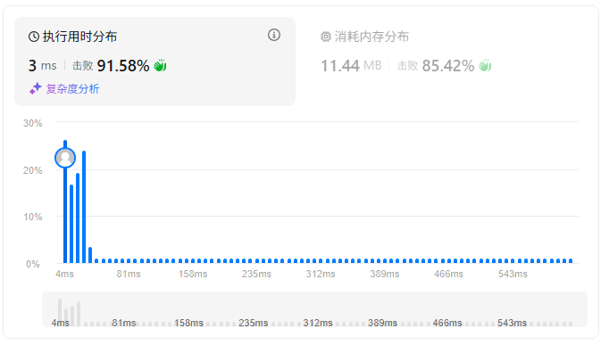
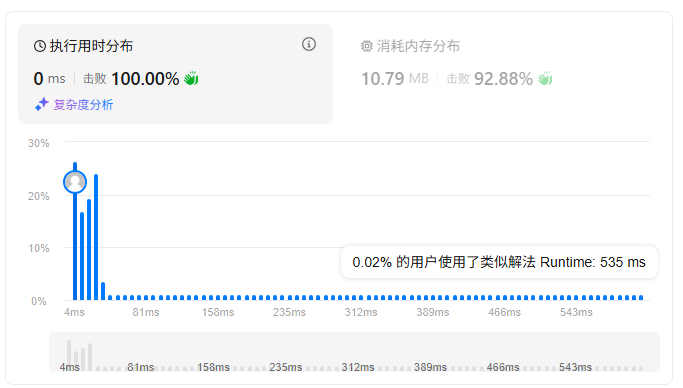

题目描述：  
（PS：执行用时、消耗内存情况，每次提交可能结果不同，去掉注释速度可能更快）  
给定一个字符串 s ，请你找出其中不含有重复字符的 最长 子串 的长度。
```
示例 1:

输入: s = "abcabcbb"
输出: 3 
解释: 因为无重复字符的最长子串是 "abc"，所以其长度为 3。
```
```
示例 2:

输入: s = "bbbbb"
输出: 1
解释: 因为无重复字符的最长子串是 "b"，所以其长度为 1。
```
```
示例 3:

输入: s = "pwwkew"
输出: 3
解释: 因为无重复字符的最长子串是 "wke"，所以其长度为 3。
     请注意，你的答案必须是 子串 的长度，"pwke" 是一个子序列，不是子串。
 
```
```
提示：

0 <= s.length <= 5 * 104
s 由英文字母、数字、符号和空格组成
```
## Python
1、遍历字符串，使用缓存串存储不重复的字串，并实时获取缓存串的长度
```python
class Solution:
    def lengthOfLongestSubstring(self, s: str) -> int:
        # 如果s长度为0，则返回0
        if len(s) == 0: return 0
        # 临时缓存串，用于存储不重复的字串
        temp_s = ""
        # 存储当前的最大长度
        max_len = 0
        # 遍历每个字符
        # 查看是否在字串中，如果在字串中，则更新最大长度，同时将缓存串更新
        for i in s:
            if i in temp_s:  # 当字符在缓存串中
                max_len = max(max_len,len(temp_s))  # 获取一次最大长度
                if i == temp_s[-1]:
                    temp_s = i  # 如果是缓存串的最后一个字符，将缓存串赋值为当前字符
                else:
                    # 缓存串更新为：重复字符的下一个字符开始的串，并且加上当前字符
                    temp_s = temp_s[temp_s.index(i)+1:] + i
            else:
                # 如果不在缓存串，加上当前字符
                temp_s += i
        # 例如：当所有字符没有重复时，需要最后判断一下最大长度
        max_len = max(max_len,len(temp_s))
        return max_len
```


2、遍历字符串，符合条件的字串为一个窗口，窗口右侧索引-左侧索引+1是当前窗口（字串）的长度，这个窗口是动态的，窗口右侧一定是当前字符的索引值，而窗口左侧是根据字符是否在窗口中进行动态调整的，如果当前字符在窗口中，就需要更新窗口左侧的索引，而为了记录字符对应的索引值，需要将每个字符及对应的索引，存到字典中，key为字符value为索引，如果字符在字典中，且字典中的字符索引大于等于当前字符的索引时，说明字符在窗口中
```python
class Solution:
    def lengthOfLongestSubstring(self, s: str) -> int:
        temp_s = {}  # key:存放不重复字符，value：字符所在的索引（最大索引）
        max_len = 0  # 存储最大长度
        left_index = 0  # 当前字串窗口的左节点索引
        for right_index,value in enumerate(s):
            # 当前字符在缓存字典中，说明之前出现过这个字符
            # 当前字符在字典中的索引，要大于等于左节点索引，说明当前字符在字符串窗口中
            # 如果小于，说明是在窗口左侧已经脱离窗口的串中
            # 更新窗口左侧的索引值
            if value in temp_s.keys() and temp_s[value] >= left_index:
                left_index = temp_s[value] + 1
            # 更新字典内容
            temp_s[value] = right_index
            # 当前字符的索引，就是窗口的右侧索引
            cur_len = right_index - left_index + 1
            if cur_len > max_len:
                max_len = cur_len
        return max_len
```



## C++
1、将上面的py代码转为c++
```c++
class Solution {
public:
    int lengthOfLongestSubstring(string s) {
        unordered_map<char,int> temp_s;
        unsigned max_len = 0;
        unsigned left_index = 0;
        for (int i=0; i < s.length(); i++)
        {
            if (temp_s.find(s[i]) != temp_s.end() && temp_s[s[i]] >= left_index)
            {
                left_index = temp_s[s[i]] + 1;
            }
            temp_s[s[i]] = i;
            unsigned cur_len = i - left_index + 1;
            if (cur_len > max_len)
            {
                max_len = cur_len;
            }
        }
        return max_len;
    }
};
```


2、创建一个数组，长度为128，index表示当前所有的ASCII字符，数组中的初始值均为-1，后续用于存储各字符在s中的索引，其中left_index是窗口左侧索引的前一个位置，初始化为-1表示还没开始，遍历字符串s，当前字符，在myhash中（字符ASCII值即为索引）指定位置的值大于left_index时，说明当前字符在窗口中，需要将left_index更新为myhash索引值（也就是窗口左侧前一个位置）
```c++
class Solution {
public:
    int lengthOfLongestSubstring(string s) {
        vector<int> myhash(128, -1);
        int left_index = -1;
        int max_len = 0;
        for (int right_index=0;right_index<s.size();right_index++)
        {
            if (myhash[s[right_index]] > left_index)
            {
                left_index = myhash[s[right_index]];
            }
            myhash[s[right_index]] = right_index;
            max_len = max(max_len, right_index - left_index);
        }
        return max_len;
    }
};
```

