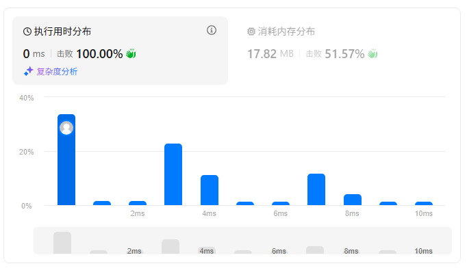

题目描述：  
（PS：执行用时、消耗内存情况，每次提交可能结果不同，去掉注释速度可能更快）  
给定两个大小分别为 m 和 n 的正序（从小到大）数组 nums1 和 nums2。请你找出并返回这两个正序数组的 中位数 。

算法的时间复杂度应该为 O(log (m+n)) 。
```
示例 1：

输入：nums1 = [1,3], nums2 = [2]
输出：2.00000
解释：合并数组 = [1,2,3] ，中位数 2
```
```
示例 2：

输入：nums1 = [1,2], nums2 = [3,4]
输出：2.50000
解释：合并数组 = [1,2,3,4] ，中位数 (2 + 3) / 2 = 2.5
 
```
 
```
提示：

nums1.length == m
nums2.length == n
0 <= m <= 1000
0 <= n <= 1000
1 <= m + n <= 2000
-106 <= nums1[i], nums2[i] <= 106
```
## Python
1、合并两个列表，对列表排序，对长度除2得到中间位置数字，如果是整数返回两个列表中间位置值的平均值，否则直接返回列表中的值  
注意：时间复杂度为O(m+n)，不满足O(log (m+n))
```python
class Solution:
    def findMedianSortedArrays(self, nums1: List[int], nums2: List[int]) -> float:
        new_list = [*nums1,*nums2]
        new_list.sort()
        mid_index = len(new_list) / 2
        if mid_index == int(mid_index):
            return (new_list[int(mid_index)] + new_list[int(mid_index)-1]) / 2
        else:
            return new_list[int(mid_index)]
```


## C++
