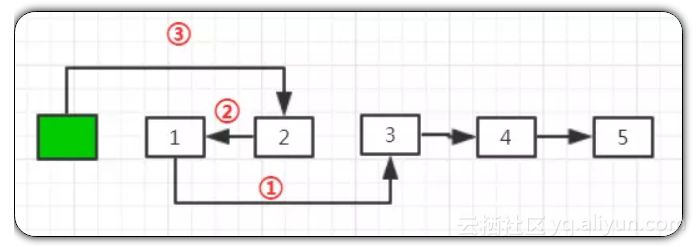

## 目录

   * [1 两数之和](#1-两数之和) 
   * [2 两数相加](#2-两数相加) 
   * [3 无重复字符的最长子串](#3-无重复字符的最长子串) 
   * [4 寻找两个有序数组的中位数](#4-寻找两个有序数组的中位数) 
   * [5 最长回文子串](#5-最长回文子串) 
   * [6 Z字形变换](#6-Z字形变换) 
   * [7 整数反转](#7-整数反转) 
   * [8 字符串转换整数](#8-字符串转换整数) 
   * [9 回文数](#9-回文数) 
   * [10 正则表达式匹配](#10-正则表达式匹配) 
   * [12 整数转罗马数字](#12-整数转罗马数字) 
   * [13 罗马数字转整数](#13-罗马数字转整数) 
   * [14 最长公共前缀](#14-最长公共前缀) 
   * [15 三数之和](#15-三数之和) 
   * [16 最接近的三数之和](#16-最接近的三数之和) 
   * [17 电话号码的字母组合](#17-电话号码的字母组合) 
   * [18 四数之和](#18-四数之和) 
   * [19 删除链表的倒数第N个节点](#19-删除链表的倒数第N个节点) 
   * [20 有效的括号](#20-有效的括号) 
   * [21 合并两个有序链表 ](#21-合并两个有序链表 ) 
   * [22 括号生成](#22-括号生成) 
   * [23 合并K个排序链表](#23-合并K个排序链表) 
   * [24 两两交换链表中的节点](#24-两两交换链表中的节点) 

  
    

#### 1 两数之和  
给定一个整数数组`nums`和一个目标值`target`，请你在该数组中找出和为目标值的那`两个`整数，并返回他们的数组下标。
你可以假设每种输入只会对应一个答案。但是，你不能重复利用这个数组中同样的元素。

示例:
```
给定 nums = [2, 7, 11, 15], target = 9
因为 nums[0] + nums[1] = 2 + 7 = 9
所以返回 [0, 1]
```
分析思路：遍历列表，判断target-nums[i]是否在nums[i+1::]中，返回i和target-nums[i]在nums中的索引  
```python
class Solution:
    def twoSum(self, nums, target):
        """
        :type nums: List[int]
        :type target: int
        :rtype: List[int]
        """
        for i in range(len(nums)-1):
            anothers = nums[i+1::]
            if target-nums[i] in anothers:
                return [i,anothers.index(target-nums[i] )+i+1]
```
执行用时 : 1148 ms  
内存消耗 : 13.6 MB  
最优代码：看了网上大神的解答，使用`enumerate()`将`nums`组合成一个索引，遍历索引和值，将索引、值分别存到字典的值和键，反查`target`和当前
值的差值是否在字典中的key中，如果不存在继续存储索引和值，如果存在，返回当前索引和匹配字典key的值（也就是nums的索引）
```python
class Solution:
    def twoSum(self, nums, target):
        """
        :type nums: List[int]
        :type target: int
        :rtype: List[int]
        """
        a = dict()
        for k,v in enumerate(nums):   # enumerate()方法将可迭代对象组合成一个索引序列  
            other_num = target - v
            if other_num in a.keys():
                return [a[other_num],k]
            a[v] = k   # 将值作为字典的key，将索引作为字典的值
```
执行用时 : 88 ms  
内存消耗 : 14.1 MB  

#### 2 两数相加  
给出两个` 非空 `的链表用来表示两个非负的整数。其中，它们各自的位数是按照` 逆序 `的方式存储的，并且它们的每个节点只能存储` 一位 `数字。
如果，我们将这两个数相加起来，则会返回一个新的链表来表示它们的和。
您可以假设除了数字 0 之外，这两个数都不会以 0 开头。

示例：
```
输入：(2 -> 4 -> 3) + (5 -> 6 -> 4)
输出：7 -> 0 -> 8
原因：342 + 465 = 807 
```
分析思路一：将两个链表转换为数值，相加后，将结果再转换为链表
```python
# Definition for singly-linked list.
class ListNode:
    def __init__(self, x):
        self.val = x
        self.next = None

class Solution:
    def addTwoNumbers(self, l1, l2):
        """
        :type l1: ListNode
        :type l2: ListNode
        :rtype: ListNode
        """
        a = list()
        b = list()
        while l1:
            a.append(str(l1.val))
            l1 = l1.next
        while l2:
            b.append(str(l2.val))
            l2 = l2.next
        a.reverse()
        b.reverse()
        a, b = int(''.join(a)), int(''.join(b))
        s = a + b
        l3 = ListNode(s%10)
        cur = l3
        while s//10:
            s = s//10
            cur.next = ListNode(s%10)
            cur = cur.next
        return l3
```
执行用时 : 236 ms  
内存消耗 : 13.1 MB  
分析思路二：对其中一个链表进行遍历，两个链表相同位置的节点之和大于10的进位，当一个链表到达尾节点时停止遍历，同时需要注意遍历结束时最后节点之和的情况
```python
class ListNode:
    def __init__(self, x):
        self.val = x
        self.next = None

class Solution:
    def addTwoNumbers(self, l1, l2):
        """
        :type l1: ListNode
        :type l2: ListNode
        :rtype: ListNode
        """
        l3 = ListNode(l1.val+l2.val)
        cur = l3
        while l1.next or l2.next:

            if cur.val >= 10:
                if l1.next:
                    l1.next.val += 1
                else:
                    l2.next.val += 1
                cur.val = cur.val % 10
                
            if l1.next and l2.next:
                l1, l2 = l1.next, l2.next
                cur.next = ListNode(l1.val+l2.val)
            elif l1.next:
                l1 = l1.next
                cur.next = ListNode(l1.val)
            elif l2.next:
                l2 = l2.next
                cur.next = ListNode(l2.val)
            cur = cur.next
                
        if cur.val >= 10:
            cur.next = ListNode(1)
            cur.val = cur.val % 10
            
        return l3
        # 另一个版本：
        # l3 = l1
        # while l1:
        #     l1.val = l1.val + l2.val
        #     if l1.val > 9 and l1.next:
        #         l1.val, l1.next.val = l1.val%10, l1.next.val+1
        #     elif l1.val > 9:
        #         l1.val = l1.val%10
        #         l1.next = ListNode(1)
        #     if l1.next and not l2.next:
        #         l2.next = ListNode(0)
        #     elif l2.next and not l1.next:
        #         l1.next = ListNode(0)
        #     l1, l2 = l1.next, l2.next
        # return l3
```
执行用时 : 124 ms  (多次测试，结果不一致，196ms，204ms，220ms)  
内存消耗 : 13.2 MB  
贴一下网上96ms（我提交后是184ms）的代码：
```python
class ListNode:
    def __init__(self, x):
        self.val = x
        self.next = None

class Solution:
    def addTwoNumbers(self, l1, l2):
        """
        :type l1: ListNode
        :type l2: ListNode
        :rtype: ListNode
        """
        add = 0     
        l3 = ListNode(0)
        node = l3
        while l1 or l2:
            cur = ListNode(add)
            if l1:
                cur.val += l1.val
                l1 = l1.next
            if l2:
                cur.val += l2.val
                l2 = l2.next
            add = cur.val // 10
            cur.val = cur.val % 10
            node.next, node = cur, cur
        if add:
            node.next = ListNode(add)
        return l3.next
```

#### 3 无重复字符的最长子串  
给定一个字符串，请你找出其中不含有重复字符的` 最长子串 `的长度。  

示例 1:
```
输入: "abcabcbb"
输出: 3 
解释: 因为无重复字符的最长子串是 "abc"，所以其长度为 3。
```
示例 2:
```
输入: "bbbbb"
输出: 1
解释: 因为无重复字符的最长子串是 "b"，所以其长度为 1。
```
示例 3:
```
输入: "pwwkew"
输出: 3
解释: 因为无重复字符的最长子串是 "wke"，所以其长度为 3。
     请注意，你的答案必须是 子串 的长度，"pwke" 是一个子序列，不是子串。
```

分析思路一：遍历str，新建列表存储子串，将新字符入栈，如果新的字符不在子集中，不做处理；如果在，删除子集中字符及之前的字符；
```python
class Solution:
    def lengthOfLongestSubstring(self, s):
        """
        :type s: str
        :rtype: int
        """
        max_length = 0
        max_list = list()
        for i in s:
            if i in max_list:
                max_list = max_list[max_list.index(i)+1:]
                max_list.append(i)
            else:
                max_list.append(i)
                max_length = max(len(max_list),max_length)
        return max_length
```
最优代码： 使用字符串存储子集
```python
class Solution:
    def lengthOfLongestSubstring(self, s):
        """
        :type s: str
        :rtype: int
        """
        substring = ''
        longestlength = 0

        for le in s:
            if le not in substring:
                substring = substring + le
            else:
                longestlength = max(len(substring),longestlength)
                substring = substring[substring.index(le)+1:]
                substring = substring + le
        longestlength = max(len(substring),longestlength)

        return longestlength
```

### 4 寻找两个有序数组的中位数  
给定两个大小为` m `和` n `的有序数组` nums1 `和` nums2`。

请你找出这两个有序数组的中位数，并且要求算法的时间复杂度为` O(log(m + n))`。

你可以假设` nums1 `和` nums2 `不会同时为空。

示例 1:
```
nums1 = [1, 3]
nums2 = [2]

则中位数是 2.0
```
示例 2:
```
nums1 = [1, 2]
nums2 = [3, 4]

则中位数是 (2 + 3)/2 = 2.5
```
分析思路：合并数组后，根据数组长度的奇偶性，返回不同的值
```python
class Solution:
    def findMedianSortedArrays(self, nums1, nums2):
        """
        :type nums1: List[int]
        :type nums2: List[int]
        :rtype: float
        """
        nums3 = sorted(nums1+nums2)
        length = len(nums3)
        mid_index = int(length / 2)
        return (nums3[mid_index-1]+nums3[mid_index])/2 if mid_index==length/2 else nums3[mid_index]
```

### 5 最长回文子串  

给定一个字符串` s`，找到` s `中最长的回文子串。你可以假设` s `的最大长度为` 1000`。

示例 1：
```
输入: "babad"
输出: "bab"
注意: "aba" 也是一个有效答案。
```
示例 2：
```
输入: "cbbd"
输出: "bb"
```
思路一：多层循环，从头遍历字符串中每个元素，得到s[i]再从该元素后面的子串进行从尾部遍历，获取同s[i]相等的元素，判断是否是回文子串
```python
class Solution:
    def longestPalindrome(self, s):
        """
        :type s: str
        :rtype: str
        """
        if len(s) <= 1:
            return s
        max_length = 0
        max_str = s[0]
        for i in range(len(s)):   # 从头遍历字符串
            if max_length > len(s)-i:
                break
            j = -1
            for j in range(len(s)-1,i,-1):   # 从尾部遍历字符串，获取与s[i]相同的值
                if j-i+1 > max_length and s[i] == s[j]:
                    flag = True
                    for  n in range(0,int((j-i+1)/2)):   # 进行回文子串判断
                        if s[i+n] != s[j-n]:
                            flag = False
                            break
                    if flag:
                        max_length = j-i+1
                        max_str = s[i:j+1]
        return max_str
```
提交超时，使用Pycharm检测通过

(网上)思路二：中心枚举，首先将回文子串变成奇数串，使用#填充` #a#b#c# `,` #a#d#c#f# `，从新字符串的第三个元素开始遍历至倒数第三个，假定遍历的元素是回文子串的中心位置，从中心
位置向两端遍历，判断是否为回文子串，这样相对思路一，少一层遍历：

最优代码：
```python
class Solution:
    def longestPalindrome(self, s):
        """
        :type s: str
        :rtype: str
        """
        length = len(s)
        if length < 2 or s == s[::-1]: return s
        max_len, begin = 1, 0
        for i in range(1, length):
            odd = s[i - max_len - 1:i + 1]
            even = s[i - max_len:i + 1]
            if i - max_len >= 1 and odd == odd[::-1]:
                begin = i - max_len - 1
                max_len += 2
                continue
            if i - max_len >= 0 and even == even[::-1]:
                begin = i - max_len
                max_len += 1
        return s[begin:begin + max_len]
```
执行用时 : 76 ms  
内存消耗 : 13.2 MB  

### 6 Z字形变换  

将一个给定字符串根据给定的行数，以从上往下、从左到右进行` Z `字形排列。

比如输入字符串为` "LEETCODEISHIRING" `行数为` 3 `时，排列如下：
```
L   C   I   R
E T O E S I I G
E   D   H   N
```
之后，你的输出需要从左往右逐行读取，产生出一个新的字符串，比如："LCIRETOESIIGEDHN"。

请你实现这个将字符串进行指定行数变换的函数：

string convert(string s, int numRows);
示例 1:
```
输入: s = "LEETCODEISHIRING", numRows = 3
输出: "LCIRETOESIIGEDHN"
```
示例 2:
```
输入: s = "LEETCODEISHIRING", numRows = 4
输出: "LDREOEIIECIHNTSG"
解释:

L     D     R
E   O E   I I
E C   I H   N
T     S     G

```

思路一：将图形进行数学建模，发现Z字形符合一定的函数样式：

```
   |-------------------->  x
   | L     D     R
   | E   O E   I I
   | E C   I H   N
   | T     S     G
 y v
 
 分段函数：  0 <= y < numRows
 
            if x % (numRows-1) == 0 :
                0 <= y < numRows 值全取
            else:
                只有一个值  x,y符合 (numRows-1-x-y) % (numRows-1) == 0 
                其他位置使用''占位

```
新建二位数组，纵向遍历，将字符串中的字符按照规则，依次放入数组中，没有字符的位置使用''占位，对获得的二维数组进行横向遍历，转换为字符串，获得结果

```python
class Solution:
    def convert(self, s, numRows):
        """
        :type s: str
        :type numRows: int
        :rtype: str
        """
        if len(s) <= numRows or not numRows or not s or numRows == 1:
            return s
        x = 0
        i = 0
        res = list()
        while 1:   # 对x遍历
            if i >= len(s):
                return ''.join([m[y] for y in range(numRows) for m in res])
            res.append([])
            if x % (numRows-1) == 0:   # 在纵向上的情况
                for y in range(numRows):
                    if i >= len(s):
                        res[x].append('')
                    else:
                        res[x].append(s[i])
                        i += 1
            else:                        # 在斜线上情况，只有一个值
                for y in range(numRows):
                    if (numRows-1-x-y) % (numRows-1) == 0 and i < len(s) :
                        res[x].append(s[i])
                        i += 1
                    else:
                        res[x].append('')
            x += 1
```
执行用时 : 1596 ms  
内存消耗 : 18.2 MB  


思路二：官方题解，按照与逐行读取 Z 字形图案相同的顺序访问字符串。

最优解答：

```

L     D     R
E   O E   I I
E C   I H   N
T     S     G


L =  [  L , E , E , T  ]
                C
            O
        D   E   I   S
                H
            I
        R   I   N   G

```


```python

class Solution:
    def convert(self, s, numRows):
        """
        :type s: str
        :type numRows: int
        :rtype: str
        """

        if numRows == 1 or numRows >= len(s):
            return s
        L = [''] * numRows      # 创建结果列表，最终每个元素代表每一行结果
        index, step = 0, 1    # 设定索引，也就是s中字符要放在L中的第一个元素后面， 设定步长，控制索引，实现Z字
        for x in s:
            L[index] += x
            if index == 0:
                step = 1
            elif index == numRows - 1:
                step = -1
            index += step
        return ''.join(L)
```
执行用时 : 136 ms  
内存消耗 : 13.2 MB  


执行用时 : 72 ms, 在Reverse Integer的Python3提交中击败了61.22% 的用户
内存消耗 : 13.3 MB

### 7 整数反转  

给出一个` 32 `位的有符号整数，你需要将这个整数中每位上的数字进行反转。

示例 1:
```
输入: 123
输出: 321
```
 示例 2:
```
输入: -123
输出: -321
```
示例 3:
```
输入: 120
输出: 21
```
注意:  

假设我们的环境只能存储得下` 32 `位的有符号整数，则其数值范围为` [−2**31,  2**31 − 1]`。请根据这个假设，如果反转后整数溢出那么就返回 0。

```python
class Solution:
    def reverse(self, x):
        """
        :type x: int
        :rtype: int
        """

        res = int(''.join(list(str(x))[::-1])) if x>=0 else int('-'+''.join(list(str(-x))[::-1]))
        
        return res if res>=-2**31 and res<2**31-1 else 0
```
执行用时 : 72 ms  
内存消耗 : 13.4 MB  


网上最优：
```python

class Solution:
    def reverse(self, x):
      
        num=0
        a = abs(x)
        while(a != 0):
            temp =a % 10
            num =num*10 +temp
            a = int(a/10)
            
        if x>0 and num <2147483647:
            return num
        elif x<0 and num <=2147483647:
            return -num
        else:
            return 0
```

### 8 字符串转换整数  
请你来实现一个 atoi 函数，使其能将字符串转换成整数。  

首先，该函数会根据需要丢弃无用的开头空格字符，直到寻找到第一个非空格的字符为止。  

当我们寻找到的第一个非空字符为正或者负号时，则将该符号与之后面尽可能多的连续数字组合起来，作为该整数的正负号；假如第一个非空字符是数字，则直接将其与之后连续的数字字符组合起来，形成整数。  

该字符串除了有效的整数部分之后也可能会存在多余的字符，这些字符可以被忽略，它们对于函数不应该造成影响。  

注意：假如该字符串中的第一个非空格字符不是一个有效整数字符、字符串为空或字符串仅包含空白字符时，则你的函数不需要进行转换。  

在任何情况下，若函数不能进行有效的转换时，请返回 0。  

说明：  

假设我们的环境只能存储 32 位大小的有符号整数，那么其数值范围为` [−2**31,  2**31 − 1]`。如果数值超过这个范围，请返回`−2**31`或`2**31 − 1` 。  

示例 1:
```
输入: "42"
输出: 42
```
示例 2:
```
输入: "   -42"
输出: -42
解释: 第一个非空白字符为 '-', 它是一个负号。
     我们尽可能将负号与后面所有连续出现的数字组合起来，最后得到 -42 。
 ```
示例 3:
```
输入: "4193 with words"
输出: 4193
解释: 转换截止于数字 '3' ，因为它的下一个字符不为数字。
```
示例 4:
```
输入: "words and 987"
输出: 0
解释: 第一个非空字符是 'w', 但它不是数字或正、负号。
     因此无法执行有效的转换。
```
示例 5:
```
输入: "-91283472332"
输出: -2147483648
解释: 数字 "-91283472332" 超过 32 位有符号整数范围。 
     因此返回 INT_MIN (−231) 。
```


```python

class Solution:
    def myAtoi(self, str):
        """
        :type str: str
        :rtype: int
        """
        
        int_string = ['0','1','2','3','4','5','6','7','8','9']
        str = str.lstrip()
        res = ''
        if not str:
            return 0
        if str[0] in ['-','+']:
            res += str[0]
            str = str[1:]
        if not str or str[0] not in int_string:
            return 0
        for i in range(len(str)):
            if str[i] not in int_string:
                break
            res += str[i]
        res = int(res)
        if res < -2**31:
            return -2**31
        elif res >= 2**31-1:
            return 2**31-1
        return res
```
执行用时 : 100 ms  
内存消耗 : 13.2 MB  

使用正则：

```python
class Solution:
    def myAtoi(self, str):
        """
        :type str: str
        :rtype: int
        """
        
        import re
        
        p = re.compile(r'^((-|\+)\d+)|(\d+)')
        re_p = p.match(str.lstrip())
        if not re_p:
            return 0
        else:
            res = int(re_p.group(0))

        res = res if res >= -2**31 else -2**31
        res = res if res < 2**31-1 else 2**31-1
        return res
```
执行用时 : 80 ms  
内存消耗 : 13.2 MB  

### 9 回文数  

判断一个整数是否是回文数。回文数是指正序（从左向右）和倒序（从右向左）读都是一样的整数。

示例 1:
```
输入: 121
输出: true
```
示例 2:
```
输入: -121
输出: false
解释: 从左向右读, 为 -121 。 从右向左读, 为 121- 。因此它不是一个回文数。
```
示例 3:
```
输入: 10
输出: false
解释: 从右向左读, 为 01 。因此它不是一个回文数。
```

直接对整数进行处理：
```python
class Solution:
    def isPalindrome(self, x: int) -> bool:
        if x < 0:
            return False
        a = x
        b = 0
        while True:
            b = b*10 + a % 10
            if a < 10:
                break
            a = a // 10
        
        return b == x
```
执行用时 : 500 ms  
内存消耗 : 13.3 MB  

转换为str处理
```python
class Solution:
    def isPalindrome(self, x: int) -> bool:
        try:
            if x==int(str(x)[::-1]):
                return True
            else:
                return False
        except:
            return False
```
执行用时 : 308 ms  
内存消耗 : 13.2 MB  

### 10 正则表达式匹配  
pass

### 11 盛水最多的容器  
给定 n 个非负整数 a1，a2，...，an，每个数代表坐标中的一个点 (i, ai) 。在坐标内画 n 条垂直线，垂直线 i 的两个端点分别为 (i, ai) 和 (i, 0)。找出其中的两条线，使得它们与 x 轴共同构成的容器可以容纳最多的水。

说明：你不能倾斜容器，且 n 的值至少为 2。


示例:
```
输入: [1,8,6,2,5,4,8,3,7]
输出: 49
```

思路及代码：
```python
class Solution:
    def maxArea(self, height: List[int]) -> int:
        # 思路一：双层循环，官方肯定不同意这么做滴，所以超时了
        # max_v = 0
        # for i in range(len(height)-1):
        #     for j in range(i+1,len(height)):
        #         v = height[i]*(j-i) if height[i]<height[j] else height[j]*(j-i)
        #         max_v = max(max_v,v)
        # return max_v
        
        
        # 思路二：看了官方题解，使用动态规划：先选取最左侧和最右侧的两个柱子，计算出面积，作为初始值
        # 接下来这两个柱子向内移动，矩形的长必然要变小，所以向内移动的柱子要选相对短的那根，留住相对高的柱子，来保证面积最优，下面是网友的题解
        
        i, j = 0, len(height) - 1
        max_area = 0
        while i < j:
            if height[i] > height[j]:
                area = (j - i) * height[j]
                j -= 1
            else:
                area = (j - i) * height[i]
                i += 1
            if area > max_area:
                max_area = area
        return max_area
```
执行用时 : 72 ms  
内存消耗 : 14.4 MB  

### 12 整数转罗马数字  
罗马数字包含以下七种字符： I， V， X， L，C，D 和 M。
```
字符          数值
I             1
V             5
X             10
L             50
C             100
D             500
M             1000
例如， 罗马数字 2 写做 II ，即为两个并列的 1。12 写做 XII ，即为 X + II 。 27 写做  XXVII, 即为 XX + V + II 。
```

通常情况下，罗马数字中小的数字在大的数字的右边。但也存在特例，例如 4 不写做 IIII，而是 IV。数字 1 在数字 5 的左边，所表示的数等于大数 5 减小数 1 得到的数值 4 。同样地，数字 9 表示为 IX。这个特殊的规则只适用于以下六种情况：
```
I 可以放在 V (5) 和 X (10) 的左边，来表示 4 和 9。
X 可以放在 L (50) 和 C (100) 的左边，来表示 40 和 90。 
C 可以放在 D (500) 和 M (1000) 的左边，来表示 400 和 900。
```
给定一个整数，将其转为罗马数字。输入确保在 1 到 3999 的范围内。

示例 1:
```
输入: 3
输出: "III"
```
示例 2:
```
输入: 4
输出: "IV"
```
示例 3:
```
输入: 9
输出: "IX"
```
示例 4:
```
输入: 58
输出: "LVIII"
解释: L = 50, V = 5, III = 3.
```
示例 5:
```
输入: 1994
输出: "MCMXCIV"
解释: M = 1000, CM = 900, XC = 90, IV = 4.
```
思路一：将千、百、十、个位数字分别建立字典，列出所有数字，对num拆分后在各自的字典里查找即可，这种方式很直接，官方肯定不认可滴，但是这种方法计算机运算效率更高，贴一下网友做的
```python
class Solution:
    def intToRoman(self, num):
        """
        :type num: int
        :rtype: str
        """
        romans = [
            ['', 'M', 'MM', 'MMM'],
            ['', 'C', 'CC', 'CCC', 'CD', 'D', 'DC', 'DCC', 'DCCC', 'CM'],
            ['', 'X', 'XX', 'XXX', 'XL', 'L', 'LX', 'LXX', 'LXXX', 'XC'],
            ['', 'I', 'II', 'III', 'IV', 'V', 'VI', 'VII', 'VIII', 'IX']
        ]
        return romans[0][num // 1000] + romans[1][num%1000 // 100]\
               + romans[2][num%100 // 10] + romans[3][num%10]
```
思路二：将特定罗马字符建立字典，对num拆分后再做查找

```python
class Solution:
    def intToRoman(self, num: int) -> str:
        Rom_str={1:'I' ,5:'V', 10:'X', 50:'L', 100:'C', 500:'D',1000:'M',
                4:'IV', 9:'IX', 40:'XL', 90:'XC', 400:'CD', 900:'CM'}
        res = ''  # 结果字符串
        
        for k in [1000,100,10,1]:
            get_num = (num // k) * k
            num = num % k
            if get_num and get_num in Rom_str.keys():
                res += Rom_str[get_num]
            elif get_num and get_num//k <5:
                res += Rom_str[k] * (get_num//k)
            elif get_num:
                res +=Rom_str[5*k] + Rom_str[k] * (get_num//k-5)
                
        return res
```
执行用时 : 156 ms  
内存消耗 : 13.3 MB  

最优解题：
```python
class Solution:
    def intToRoman(self, num):
        """
        :type num: int
        :rtype: str
        """
        res = ''
        token = [(1000, 'M'), (900, 'CM'), (500, 'D'), (400, 'CD'), (100, 'C'), (90, 'XC'), (50, 'L'), (40, 'XL'), (10, 'X'), (9, 'IX'), (5, 'V'), (4, 'IV'), (1, 'I')]
        for n, t in token:
            while num >= n:
                res += t;
                num -= n
        return res
```
执行用时 : 228 ms 提交后测试数据，肯定有问题！  
内存消耗 : 13.2 MB

### 13 罗马数字转整数  

给定一个罗马数字，将其转换成整数。输入确保在 1 到 3999 的范围内。

思路：简历换算字典，依次读取字符串，先判断是否是特殊情况

```python
class Solution:
    def romanToInt(self, s):
        """
        :type s: str
        :rtype: int
        """
        Rom_str={'I':1 ,'V':5, 'X':10, 'L':50, 'C':100, 'D':500,'M':1000, 'IV':4, 'IX':9, 'XL':40, 'XC':90, 'CD':400, 'CM':900}
        
        i = 0
        res = 0
        while i<len(s):
            if len(s)>=2 and s[i:i+2] in Rom_str.keys():
                res += Rom_str[s[i:i+2]]
                i += 2
            else:
                res += Rom_str[s[i]]
                i += 1
        return res
```
执行用时 : 176 ms, 在Roman to Integer的Python3提交中击败了64.53% 的用户  
内存消耗 : 13.3 MB, 在Roman to Integer的Python3提交中击败了0.95% 的用户   

最优解答：
```python

class Solution:
    def romanToInt(self, s):
        """
        :type s: str
        :rtype: int
        """
        romandict = dict({'I':1, 'V':5, 'X':10, 'L':50, 'C':100, 'D':500, 'M':1000})
        res = 0
        if len(s) == 1:
            return romandict[s[0]]
        
        
        for i in range(len(s)-1):
            cur=s[i]
            nex=s[i+1]
            if((cur=='C' and (nex=='D' or nex=='M')) or (cur=='X' and (nex=='L' or nex=='C')) or (cur=='I' and (nex=='V' or nex=='X'))):
                res = res - romandict[cur]
            else:
                res = res + romandict[cur]
        res = res + romandict[nex]
        return res
```
ps:难道执行用时跟我的电脑有关？？？
执行用时 : 168 ms, 在Roman to Integer的Python3提交中击败了69.13% 的用户  
内存消耗 : 13.4 MB, 在Roman to Integer的Python3提交中击败了0.95% 的用户  

### 14 最长公共前缀  
编写一个函数来查找字符串数组中的最长公共前缀。

如果不存在公共前缀，返回空字符串 ""。

示例 1:
```
输入: ["flower","flow","flight"]
输出: "fl"
```
示例 2:
```
输入: ["dog","racecar","car"]
输出: ""
解释: 输入不存在公共前缀。
```
说明:

所有输入只包含小写字母 a-z 。


思路一：使用最后一个元素作为初始结果，遍历该元素，从首字母开始依次同strs剩余元素的首字母做对比，依次进行，双循环

```python
class Solution:
    def longestCommonPrefix(self, strs: List[str]) -> str:
        if not strs or '' in strs:
            return ''
        
        res = strs.pop()
        
        for i in range(len(res)):
            for str in strs:
                try:
                    if res[i] != str[i]:
                        return res[:i]
                except:
                    return res[:i]
        return res
```
执行用时 : 68 ms, 在Longest Common Prefix的Python3提交中击败了12.31% 的用户  
内存消耗 : 13.2 MB, 在Longest Common Prefix的Python3提交中击败了0.98% 的用户  

思路二：将strs进行排序，排序后，只需要对比首尾两个元素即可：
```python
class Solution:
    def longestCommonPrefix(self, strs: List[str]) -> str:
        if not strs or '' in strs:
            return ''
        
        if len(strs) == 1:
            return strs[0]
        
        strs.sort()
        res = ''
        
        length = min(len(strs[0]),len(strs[-1]))
        
        for i in range(length):
            if strs[0][i] == strs[-1][i] :
                res += strs[0][i]
            else:
                break
        return res
```
执行用时 : 56 ms, 在Longest Common Prefix的Python3提交中击败了39.85% 的用户  
内存消耗 : 13.1 MB, 在Longest Common Prefix的Python3提交中击败了0.98% 的用户  

最优解答：
```python
class Solution:
    def longestCommonPrefix(self, strs: List[str]) -> str:
        if len(strs) == 0:
            return ''
        if len(strs) == 1:
            return strs[0]

        prefix, chars = '', zip(*strs)
        for i, group in enumerate(chars):
            ch = group[0]
            for j in range(1, len(group)):
                if group[j] != ch:
                    return prefix
            prefix += strs[0][i]
        return prefix
```
ps：请自行忽视。。。。。。
执行用时 : 84 ms, 在Longest Common Prefix的Python3提交中击败了3.53% 的用户  
内存消耗 : 13.3 MB, 在Longest Common Prefix的Python3提交中击败了0.98% 的用户   

### 15 三数之和  

给定一个包含 n 个整数的数组 nums，判断 nums 中是否存在三个元素 a，b，c ，使得 a + b + c = 0 ？找出所有满足条件且不重复的三元组。

注意：答案中不可以包含重复的三元组。
```
例如, 给定数组 nums = [-1, 0, 1, 2, -1, -4]，

满足要求的三元组集合为：
[
  [-1, 0, 1],
  [-1, -1, 2]
]
```

思路一：双层循环查找，超时
```python

class Solution:
    def threeSum(self, nums: List[int]) -> List[List[int]]:
        res = list()    # 存储结果
        for i in range(len(nums)-2):   # 获取a
            for j in range(i+1,len(nums)-1):  # 获取b
                if 0-nums[i]-nums[j] in nums[j+1:]:   # 判断是否存在c
                    res_l = [nums[i],nums[j],0-nums[i]-nums[j]]
                    res_l.sort()   # 排序，方便查重
                    if res_l not in res:
                        res.append(res_l)
        return res
```

思路二：（网友解答）看注释
```python
class Solution:
    def threeSum(self, nums: List[int]) -> List[List[int]]:
        """
        对于 a + b + c = 0 共有四种可能的结果
        [0 0 0] [- + +] [- - +] [- 0 +]
        """
        ans = []  # 初始化结果
        d = {}  # 重构nums,key=num,value=该值的个数
        
        for i in nums:
            if i not in d:
                d[i] = 0  # 将i存入d的key中
            d[i] += 1
        
        posit = [a for a in d if a>0]
        naga = [b for b in d if b<0]
        
        
        
        # [0 0 0]
        if d.get(0,0)>2:
            ans.append([0,0,0])
        
        if not posit or not naga:
            return ans
        
        # [- + +]
        for a,v in enumerate(posit):
            if d[v]>1 and -2*v in d:
                ans.append([v,v,-2*v])

            for b in posit[a+1:]:
                if -v-b in d:
                    ans.append([v,b,-v-b])
        
        # [+ - -]
        for a,v in enumerate(naga):
            if d[v]>1 and -2*v in d:
                ans.append([v,v,-2*v])
                
            for b in naga[a+1:]:
                if -v-b in d:
                    ans.append([v,b,-v-b])
        
        # [- 0 +]
        if 0 in d:
            for a in posit:
                if -a in d:
                    ans.append([a,-a,0])
        return ans
```
执行用时 : 412 ms, 在3Sum的Python3提交中击败了98.97% 的用户  
内存消耗 : 17.5 MB, 在3Sum的Python3提交中击败了3.86% 的用户  

### 16 最接近的三数之和  

给定一个包括 n 个整数的数组 nums 和 一个目标值 target。找出 nums 中的三个整数，使得它们的和与 target 最接近。返回这三个数的和。假定每组输入只存在唯一答案。
```
例如，给定数组 nums = [-1，2，1，-4], 和 target = 1.

与 target 最接近的三个数的和为 2. (-1 + 2 + 1 = 2).
```

思路一：使用双层循环，先遍历整个列表，然后建立两个指针，向内移动
```python
class Solution:
    def threeSumClosest(self, nums: List[int], target: int) -> int:
        if len(nums) < 3:
            return
        nums.sort()
        res = target - nums[0] - nums[1] - nums[2]  # 存储结果同target直接的差值
        for i in range(len(nums) - 2):
            left = i + 1  # 左指针
            right = len(nums) - 1  # 右指针
            while left < right:
                k = target - nums[i] - nums[left] - nums[right]
                if abs(k) < abs(res):
                    res = k
                if k > 0:
                    left += 1
                else:
                    right -= 1
        return target-res
``` 
执行用时 : 596 ms, 在3Sum Closest的Python3提交中击败了9.82% 的用户  
内存消耗 : 13.2 MB, 在3Sum Closest的Python3提交中击败了2.33% 的用户  

看过最优解答后，优化了自己的代码：
```python

class Solution:
    def threeSumClosest(self, nums: List[int], target: int) -> int:
        if len(nums) < 3:
            return
        nums.sort()
        res = []  # 只用list存储三个数之和，最后统一处理，比每循环一次处理一次更效率  
        for i in range(len(nums) - 2):
            left = i + 1  # 左指针
            right = len(nums) - 1  # 右指针
            if nums[i] + nums[left] + nums[left+1] > target:    # 提前判断前三个数之和，提前跳出循环
                res.append(nums[i] + nums[left] + nums[left+1])
                break
            elif  nums[i] + nums[right] + nums[right-1] < target:   # 添加循环判断
                res.append(nums[i] + nums[right] + nums[right-1])
            else:
                while left < right:
                    k = nums[i] + nums[left] + nums[right]
                    res.append(k)
                    if k == target:
                        return target
                    elif k < target:
                        left += 1
                    else:
                        right -= 1
                        
        res.sort(key=lambda x: abs(x - target))    # 最后使用匿名函数获得差值数组，再进行排序，返回第一个值

        return res[0]
```

执行用时 : 88 ms, 在3Sum Closest的Python3提交中击败了94.82% 的用户  
内存消耗 : 13 MB, 在3Sum Closest的Python3提交中击败了2.33% 的用户  

### 17 电话号码的字母组合  

给定一个仅包含数字 2-9 的字符串，返回所有它能表示的字母组合。  

给出数字到字母的映射如下（与电话按键相同）。注意 1 不对应任何字母。  


示例:
```
输入："23"
输出：["ad", "ae", "af", "bd", "be", "bf", "cd", "ce", "cf"].
说明:
尽管上面的答案是按字典序排列的，但是你可以任意选择答案输出的顺序。
```
```python
class Solution:
    def letterCombinations(self, digits: str) -> List[str]:
        # 双层循环,递归，属于满多叉树的遍历
        num_dict={     # 建立转换字典
            1:'',
            2:['a','b','c'],
            3:['d','e','f'],
            4:['g','h','i'],
            5:['j','k','l'],
            6:['m','n','o'],
            7:['p','q','r','s'],
            8:['t','u','v'],
            9:['w','x','y','z']
        }
        ans = []  # 返回结果
        if len(digits) == 0:
            return []
        if len(digits) == 1:
            return num_dict[int(digits)]
        res = digits[1:] #剩余的可选字符
        for i in self.letterCombinations(res):
            for j in num_dict[int(digits[0])]:
                ans.append(j+i)
        return ans
```

执行用时 : 52 ms, 在Letter Combinations of a Phone Number的Python3提交中击败了27.88% 的用户  
内存消耗 : 13 MB, 在Letter Combinations of a Phone Number的Python3提交中击败了0.71% 的用户  


网上最优解答：思路非常好，当之无愧！
```python

class Solution:
    def letterCombinations(self, digits: str) -> List[str]:
        num={
            '2':['a','b','c'],
            '3':['d','e','f'],
            '4':['g','h','i'],
            '5':['j','k','l'],
            '6':['m','n','o'],
            '7':['p','q','r','s'],
            '8':['t','u','v'],
            '9':['w','x','y','z']
        }
        if len(digits)==0:
            return []
        res=['']   # 定义为''可进行第一次遍历入值
        for i in range(len(digits)):   # 对digits进行遍历
            dlist=num[digits[i]]   # 获取当前数字对于的字母列表
            new_res=[]       # 初始化当前循环的结果
            for j in range(len(res)):    # 对上一次结果进行遍历
                for k in range(len(dlist)):    # 对当前数字的字母列表进行遍历
                    new_res.append(res[j]+dlist[k])   # 将当前数字的字母依次结合到之前的结果上，保存到本次循环的结果上
            del res[:]   # 删除上一次遍历的结果
            res=new_res.copy()  # 将本次循环的结果复制给总结果
        return res
```

### 18 四数之和  


给定一个包含 n 个整数的数组 nums 和一个目标值 target，判断 nums 中是否存在四个元素 a，b，c 和 d ，使得 a + b + c + d 的值与 target 相等？找出所有满足条件且不重复的四元组。

注意：

答案中不可以包含重复的四元组。

示例：
```
给定数组 nums = [1, 0, -1, 0, -2, 2]，和 target = 0。

满足要求的四元组集合为：
[
  [-1,  0, 0, 1],
  [-2, -1, 1, 2],
  [-2,  0, 0, 2]
]
```

思路一：从两数之和、三数之和，到现在的四数之和，也真是够了，先上个暴力的多层循环，超时了，本地正常使用
```python
class Solution:
    def fourSum(self, nums: List[int], target: int) -> List[List[int]]:
        # 思路一：暴力模式，多层循环，已被抛弃
        ans = []
        length = len(nums)
        for a in range(length-3):
            for b in range(a+1,length-2):
                for c in range(b+1,length-1):
                    if target-nums[a]-nums[b]-nums[c] in nums[c+1:]:
                        l = [nums[a],nums[b],nums[c],target-nums[a]-nums[b]-nums[c]]
                        l.sort()
                        if l not in ans:
                            ans.append(l)
        return ans
```
思路二：网上的递归方式，直接解决N数之和，妈妈再也不用担心我的多数求和问题了

```python
class Solution:
    def fourSum(self, nums: List[int], target: int) -> List[List[int]]:
        def anySum(nums,target,N,result,results):
            """
            nums:待处理的数组
            target:剩余的和值
            N: 待处理的N个数之和，个数
            result:临时结果值
            results:最终结果值，符合Python列表数据的可变类型
            """
            if len(nums) < N or N < 2 or target < nums[0] * N or target > nums[-1] * N:  # 排除不良情况
                return  
            
            if N == 2:  # 多个数求和过程，最终都落到了这里
                l, r = 0, len(nums) - 1
                while l < r:
                    s = nums[l] + nums[r]
                    if s == target:
                        results.append(result+[nums[l],nums[r]])
                        l += 1
                        
                        while l < r and nums[l] == nums[l-1]:  # 排除相等的数字，拒绝重复
                            l += 1
                            
                    elif s < target:
                        l += 1
                    else:
                        r -= 1
            else:
                for i in range(len(nums)-N+1):
                    if i == 0 or (i>0 and nums[i-1] != nums[i]):
                        anySum(nums[i+1:],target-nums[i],N-1,result+[nums[i]],results)
        
        results = []
        anySum(sorted(nums),target,4,[],results)
        return results
```

执行用时 : 132 ms, 在4Sum的Python3提交中击败了89.75% 的用户  
内存消耗 : 13.3 MB, 在4Sum的Python3提交中击败了4.09% 的用户  

最优代码：非递归方式完美解决，主要是优化了多层循环，设置多个条件，减少不必要的循环，思路不错  

```python
class Solution:
    def fourSum(self, nums: List[int], target: int) -> List[List[int]]:
        res = []
        nums.sort()
        # 这种求和为了减少步骤首先是排序比较  哎哎哎
        a = nums[:4]
        if sum(nums[:4]) > target:
            return res
        for index, num in enumerate(nums[:-3]):
            target1 = target - num
            if sum(nums[index: index + 4]) > target:
                break
                #下面的条件是最后的三个数比target1还小就是在target1固定的情况下达不到目标了
                #或者是我现在的数和我上一次的数相同  确实 这种情况下不进行下一个循环就会重复
                #记住 这个条件总的就是 要么达不到 要么会重复所以跳过
            elif sum(nums[-3:]) < target1 or (index > 0 and num == nums[index - 1]):
                continue
                #在固定第一个后第二个数进行循环 因为是四个数所以截止到倒数第三个
            for j in range(index + 1, len(nums) - 2):
                target2 = target1 - nums[j]
                #同样的道理 两种情况剔除
                if nums[j + 1] + nums[j + 2] > target2:
                    break
                elif nums[-2] + nums[-1] < target2 or (j > index + 1 and nums[j] == nums[j - 1]):
                    continue
                    #再把特殊情况剔除后达到我们最后两个数的和等于目标  用双指针法  但为什么这么写会快很多啊 不是很懂 ：（
                l, r = j + 1, len(nums) - 1
                while l < r:
                    temp = nums[l] + nums[r]
                    if temp > target2:
                        r -= 1
                    elif temp < target2:
                        l += 1
                    else:
                        res.append([num, nums[j], nums[l], nums[r]])
                        while l < r and nums[l] == nums[l + 1]:
                            l += 1
                        while l < r and nums[r] == nums[r - 1]:
                            r -= 1
                        #相等之后确实两面都要移  不然会重复 因为这两个数相等的结果都有了
                        l += 1
                        r -= 1
        return res
```
执行用时 : 100 ms, 在4Sum的Python3提交中击败了98.34% 的用户  
内存消耗 : 13.1 MB, 在4Sum的Python3提交中击败了4.09% 的用户  

### 19 删除链表的倒数第N个节点  
给定一个链表，删除链表的倒数第 n 个节点，并且返回链表的头结点。

示例：
```
给定一个链表: 1->2->3->4->5, 和 n = 2.

当删除了倒数第二个节点后，链表变为 1->2->3->5.
```
说明：

给定的 n 保证是有效的。

思路一：使用强大而邪恶的eval()，获取n个`.next`添加到变量名中
```python
# Definition for singly-linked list.
class ListNode:
    def __init__(self, x):
        self.val = x
        self.next = None

class Solution:
    def removeNthFromEnd(self, head: ListNode, n: int) -> ListNode:
        # 链表的节点删除，就是跳过节点，直接连到下一个，要注意删除头节点和尾节点的情况
        res = ListNode(0)
        cur = res
        res.next = head
        while 1:
            s = 'cur'+'.next'*(n+1)
            del_point = eval(s)
            if del_point == None:
                cur.next = cur.next.next
                break
            cur = cur.next
        
        return res.next
```
执行用时 : 80 ms, 在Remove Nth Node From End of List的Python3提交中击败了4.14% 的用户  
内存消耗 : 13.3 MB, 在Remove Nth Node From End of List的Python3提交中击败了0.57% 的用户  

思路二：链表变列表，删除后，再生成链表,两个循环，O(n):
```python
# Definition for singly-linked list.
class ListNode:
    def __init__(self, x):
        self.val = x
        self.next = None

class Solution:
    def removeNthFromEnd(self, head: ListNode, n: int) -> ListNode:
        mid_l = []
        while head:
            mid_l.append(head.val)
            head = head.next
        del mid_l[-n]
        if not mid_l:
            return []
        res = ListNode(mid_l[0])
        cur = res
        for mid_ in mid_l[1:]:
            cur.next = ListNode(mid_)
            cur = cur.next
        return res
```
执行用时 : 76 ms, 在Remove Nth Node From End of List的Python3提交中击败了5.07% 的用户  
内存消耗 : 13.1 MB, 在Remove Nth Node From End of List的Python3提交中击败了0.57% 的用户  


思路三：中规中矩的方法，在设定两个游标，先移动一个游标，使得两个游标相隔n-1，再同时移动游标，当前面的游标到尾部时，后面的游标执行删除
```python
# Definition for singly-linked list.
class ListNode:
    def __init__(self, x):
        self.val = x
        self.next = None

class Solution:
    def removeNthFromEnd(self, head: ListNode, n: int) -> ListNode:
        dummy = ListNode(0)    # 考虑删除头结点的情况
        dummy.next = head    
        fast = dummy
        slow = dummy
        for i in range(n):     # 将两个游标间隔n-1
            fast = fast.next
        
        while fast.next != None:    # 同时移动两个游标，当前面的游标移动至尾部时，结束移动
            fast = fast.next    
            slow = slow.next
            
        slow.next = slow.next.next   # 执行删除
        return dummy.next

```
执行用时 : 60 ms, 在Remove Nth Node From End of List的Python3提交中击败了38.15% 的用户  
内存消耗 : 13.3 MB, 在Remove Nth Node From End of List的Python3提交中击败了0.57% 的用户  


最优解答：使用双向链表的思路，指定前节点，先遍历至尾节点，再回溯到删除点，执行删除
```python
# Definition for singly-linked list.
class ListNode:
    def __init__(self, x):
        self.val = x
        self.next = None

class Solution:
    def removeNthFromEnd(self, head: ListNode, n: int) -> ListNode:
        node = head
        node.prev = None     
        while node.next:
            temp = node
            node = node.next
            node.prev = temp
        for i in range(n - 1):
            node = node.prev
        if(node.prev):
            node.prev.next = node.next
        else:
            head = node.next
        return head
```
执行用时 : 60 ms, 在Remove Nth Node From End of List的Python3提交中击败了38.15% 的用户  
内存消耗 : 13 MB, 在Remove Nth Node From End of List的Python3提交中击败了0.57% 的用户  

### 20 有效的括号
给定一个只包括 `'('，')'`，`'{'，'}'`，`'['，']'` 的字符串，判断字符串是否有效。

有效字符串需满足：

左括号必须用相同类型的右括号闭合。
左括号必须以正确的顺序闭合。
注意空字符串可被认为是有效字符串。

示例 1:
```
输入: "()"
输出: true
```
示例 2:
```
输入: "()[]{}"
输出: true
```
示例 3:
```
输入: "(]"
输出: false
```
示例 4:
```
输入: "([)]"
输出: false
```
示例 5:
```
输入: "{[]}"
输出: true
```
思路分析：看代码
```python
class Solution:
    def isValid(self, s: str) -> bool:
        res = []   # 结果，空栈
        for i in s:
            if i in  ['(','{','[']:   # 可以用'({[',但是效率低
                res.append(i)   # 入栈
            elif not res:
                return False   # 空栈时，出现右括号
            else:
                cur = res.pop()   
                if (cur == '(' and i == ')') or (cur == '{' and i == '}')  or (cur == '[' and i == ']'):
                    continue   # 判断是否匹配，如是，出栈
                else:
                    return False
        return not res
```
执行用时 : 52 ms, 在Valid Parentheses的Python3提交中击败了45.24% 的用户
内存消耗 : 13.1 MB, 在Valid Parentheses的Python3提交中击败了0.90% 的用户

最优代码：
```python
class Solution:
    def isValid(self, s):
        """
        :type s: str
        :rtype: bool
        """
        
        def pair(c):      # 将判断交给函数
            if c == ')':
                return '('
            if c == '}':
                return '{'
            if c == ']':
                return '['
                
        st = []
        for c in s:
            if c in ['(', '{', '[']:
                st.append(c)
            elif len(st) == 0:
                return False
            elif st[-1] == pair(c):
                st.pop()
            else:
                return False
        if len(st) == 0:
            return True
        return False
```
执行用时 : 52 ms, 在Valid Parentheses的Python3提交中击败了45.24% 的用户  
内存消耗 : 13 MB, 在Valid Parentheses的Python3提交中击败了0.90% 的用户  

### 21 合并两个有序链表  
将两个有序链表合并为一个新的有序链表并返回。新链表是通过拼接给定的两个链表的所有节点组成的。 

示例：
```
输入：1->2->4, 1->3->4
输出：1->1->2->3->4->4
```

思路一： 将链表转换为列表，排序后，转换为链表
```python
# Definition for singly-linked list.
class ListNode:
    def __init__(self, x):
        self.val = x
        self.next = None

class Solution:
    def mergeTwoLists(self, l1: ListNode, l2: ListNode) -> ListNode:
        # 思路一： 将链表转换为列表，排序后，转换为链表
        if not l1: return l2
        if not l2: return l1
        
        ll1 = []
        ll2 = []
        while l1:
            ll1.append(l1.val)
            l1 = l1.next
        while l2:
            ll2.append(l2.val)
            l2 = l2.next
        
        ll3 = ll1 + ll2
        ll3.sort()
        res = ListNode(ll3[0])
        cur = res
        for ll3_ in ll3[1:]:
            cur.next = ListNode(ll3_)
            cur = cur.next
        return res
```
执行用时 : 80 ms, 在Merge Two Sorted Lists的Python3提交中击败了8.51% 的用户  
内存消耗 : 13 MB, 在Merge Two Sorted Lists的Python3提交中击败了0.98% 的用户  


```python
# Definition for singly-linked list.
class ListNode:
    def __init__(self, x):
        self.val = x
        self.next = None

class Solution:
    def mergeTwoLists(self, l1: ListNode, l2: ListNode) -> ListNode:
        # 思路二：原地拼接
        phead=ListNode(0)   # 新建结果链表
        p=phead
        while l1 and l2:    # 遍历两个链表，依次将小的值放入结果中
            if l1.val<l2.val:
                p.next=l1
                l1=l1.next
            else:
                p.next=l2
                l2=l2.next
            p=p.next
        if l1:
            p.next=l1
        if l2:
            p.next=l2
        return phead.next
```
执行用时 : 64 ms, 在Merge Two Sorted Lists的Python3提交中击败了49.37% 的用户  
内存消耗 : 13.1 MB, 在Merge Two Sorted Lists的Python3提交中击败了0.98% 的用户  

最优解答：递归
```python
# Definition for singly-linked list.
class ListNode:
    def __init__(self, x):
        self.val = x
        self.next = None

class Solution:
    def mergeTwoLists(self, l1: ListNode, l2: ListNode) -> ListNode:
        if l1 is None and l2 is None:
            return None
        if l1 is None and l2 is not None:
            return l2
        if l1 is not None and l2 is None:
            return l1
        
        if l1.val > l2.val:
            l2.next = self.mergeTwoLists(l1, l2.next)
            return l2
        else:
            l1.next = self.mergeTwoLists(l1.next, l2)
            return l1
```
执行用时 : 64 ms, 在Merge Two Sorted Lists的Python3提交中击败了49.37% 的用户  
内存消耗 : 12.9 MB, 在Merge Two Sorted Lists的Python3提交中击败了0.98% 的用户  

### 22 括号生成
给出 n 代表生成括号的对数，请你写出一个函数，使其能够生成所有可能的并且有效的括号组合。

例如，给出 n = 3，生成结果为：
```
[
  "((()))",
  "(()())",
  "(())()",
  "()(())",
  "()()()"
]
```

最优解答：递归
```python
class Solution:
    def generateParenthesis(self, n: int) -> List[str]:
        self.res= []   # 结果
        self.generateParenthesisIter('',n,n)   # 调用生成函数
        return self.res
    def generateParenthesisIter(self,mstr,r,l):  # 参数分别为：当前字符串、剩余右括号数、剩余左括号数
        if r==0 and l==0:  # 递归结束
            self.res.append(mstr)
        if l>0:      #如果左括号的个数还有剩余，则+’(‘然后递归
            self.generateParenthesisIter(mstr+'(',r,l-1)
        if r>0 and r>l:   #如果右括号有剩余，且大于左括号的个数则+‘）’
            self.generateParenthesisIter(mstr+')',r-1,l)

```
执行用时 : 56 ms, 在Generate Parentheses的Python3提交中击败了49.61% 的用户  
内存消耗 : 13.3 MB, 在Generate Parentheses的Python3提交中击败了1.88% 的用户  

### 23 合并K个排序链表  
合并 k 个排序链表，返回合并后的排序链表。请分析和描述算法的复杂度。

示例:
```
输入:
[
  1->4->5,
  1->3->4,
  2->6
]
输出: 1->1->2->3->4->4->5->6
```
思路一：转列表处理
```python
# Definition for singly-linked list.
class ListNode:
    def __init__(self, x):
        self.val = x
        self.next = None

class Solution:
    def mergeKLists(self, lists: List[ListNode]) -> ListNode:        
        if len(lists) == 0:
            return []
        if len(lists) == 1:
            return lists[0]
        
        temp = []
        for ll in lists:
            while ll:
                temp.append(ll.val)
                ll = ll.next
        temp.sort()
        ans = ListNode(0)
        cur = ans
        for t in temp:
            cur.next = ListNode(t)
            cur = cur.next
        return ans.next
```
执行用时 : 168 ms, 在Merge k Sorted Lists的Python3提交中击败了39.10% 的用户  
内存消耗 : 17.2 MB, 在Merge k Sorted Lists的Python3提交中击败了4.16% 的用户  

最优解答：  attrgetter() 函数通常会运行的快点，并且还能同时允许多个字段进行比较
```python
# Definition for singly-linked list.
class ListNode:
    def __init__(self, x):
        self.val = x
        self.next = None

from operator import attrgetter

class Solution:
    # @param a list of ListNode
    # @return a ListNode
    def mergeKLists(self, lists):
        sorted_list = []
        for head in lists:
            curr = head
            while curr is not None:
                sorted_list.append(curr)
                curr = curr.next

        sorted_list = sorted(sorted_list, key=attrgetter('val'))
        for i, node in enumerate(sorted_list):
            try:
                node.next = sorted_list[i + 1]
            except:
                node.next = None

        if sorted_list:
            return sorted_list[0]
        else:
            return None
```
执行用时 : 116 ms, 在Merge k Sorted Lists的Python3提交中击败了68.43% 的用户  
内存消耗 : 16.6 MB, 在Merge k Sorted Lists的Python3提交中击败了4.16% 的用户  

### 24 两两交换链表中的节点  
给定一个链表，两两交换其中相邻的节点，并返回交换后的链表。

你不能只是单纯的改变节点内部的值，而是需要实际的进行节点交换。

 

示例:
```
给定 1->2->3->4, 你应该返回 2->1->4->3.
```

分析：


```python
# Definition for singly-linked list.
class ListNode:
    def __init__(self, x):
        self.val = x
        self.next = None

class Solution:
    def swapPairs(self, head: ListNode) -> ListNode:
        HEAD = ListNode(0)
        HEAD.next = head
        pre = HEAD
        while head and head.next:
            cur = head
            temp = head.next
            
            head = temp.next    # 1
            pre.next = temp
            temp.next = cur
            cur.next = head
            
            pre = cur

        return HEAD.next
```
执行用时 : 56 ms, 在Swap Nodes in Pairs的Python3提交中击败了13.64% 的用户  
内存消耗 : 13.1 MB, 在Swap Nodes in Pairs的Python3提交中击败了0.66% 的用户  


